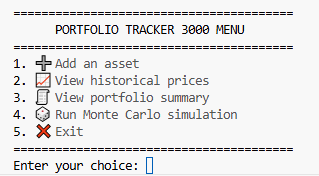

# Portfolio_Tracker3000

Welcome to this Portfolio Tracker!



- Simple investment portfolio: 2-10 assets recommended.
- User friendliness: contains a looping menu with 5 options that the user can switch between. 
- Data: imported from yahoo finance.

## How to run 
```
python -m pip install -r requirements.txt
python main.py
```
## Menu details
1. Add assets (ticker code as in yahoo Finance).
- Updates an overview table every asset entered (-> asset name, asset class, sector, market capitalization ($B), quantity, purchase price, current price, daily return (%))
- If the sector name is unknown, the name of the asset is displayed.

2. View historical prices of every ticker (USD, from 20 years ago until today)
- Opens as a graph from matlibplot in a new .png file. 
- Multiple assets on one graph possible. 
- As the user adds assets to the portfolio, the assets are added to the graph.

3. View portfolio summary:
- Assets overview as before.
- Weights (%) by asset, asset class, and sector + bars with alternating black and grey colours.
- Calculation for transaction value and total value of portfolio.

4. Run Monte Carlo simulation on the cumulative returns of the portfolio.
- Uses historical data from up to 20 years from today. 
- Simulates the portfolio for 15 years in the future.
- Runs 100,000 simulations as 10 batches of 10,000 to reduce computational effort.
- Assumes multivariate normal distribution. 
- Returns the mean cumulative returns, standard deviation and 5% VaR. 
- Generates a kernal density plot in .png to view the distribution of cumulative returns. 

## Other portfolio trackers / inspiration
- cliStocksTracker, rtscli, CodeAlpha_Stock_Portfolio_Tracker 

## Weaknesses/ improvements 
- Data cannot be refreshed such as in live stock trackers.
- Monte Carlo simulation includes highly unlikely/ overly optimistic unexpected returns. Could opt for quasi Monte Carlo, limiting the range of random sampling. 
- Monte Carlo simulation is performed in batches. Could be computationally exhaustive with a large portfolio. Could opt for ML: surrogate models for non-linear relationships, or principal component analysis (PCA) for linear relationships. See: https://www.linkedin.com/pulse/improving-real-time-portfolio-management-through-faster-rodrigues-wluze.
- Advanced model could have quasi-Monte Carlo with PCA, reducing dimensionality. See: https://www.researchgate.net/publication/265198341_Principal_Component_Analysis_in_Quasi_Monte_Carlo_Simulation
- Does not yet allow users to remove or edit assets. 
- Desire for comparison with benchmark such as US Treasury yield.
- Could include more risk metrics: Sharpe ratio, Expected shortfall, cVaR etc. 

